# rater-audit

**Your experts agree with each other. That does not mean they are right.**

Expert ratings train and evaluate AI models, and they are usually checked with agreement scores, rater screens and
small acceptance samples. rater-audit measures where those checks mislead, tests fixes on real ratings with an
expert gold label, and runs as a per-batch quality gate next to a rating platform.

Video Overview

https://github.com/user-attachments/assets/57304229-d6b7-4184-8e96-21a91306eda6

## On real ratings with an expert gold label

DICES-350: 350 real chatbot conversations, 123 real raters who each rated all of them for safety, and an expert
safety label per conversation. A production batch is rebuilt by drawing 3 real raters per conversation; 20% of
conversations serve as the gold set and every number below is measured on the other 80% (200 random splits).

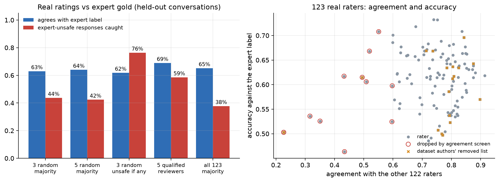
*Left: no number of crowd raters reaches the expert label; five reviewers chosen on the gold set do best at the same cost. Right: a rater's agreement with the panel says little about their accuracy (correlation 0.18).*

| Check | What it suggests | What the expert label shows |
|---|---|---|
| 3 raters per item | raw agreement 64% | the majority matches the expert 63% and catches 44% of expert-unsafe responses |
| More raters | 5, or all 123 | 64% and 65%: the gap is systematic; more votes do not close it |
| **Qualified reviewers** | 5 raters chosen on gold accuracy | **69%** match, **59%** of unsafe caught, vs 64% and 42% for 5 random raters (same cost) |
| Rater screens | drop 12 of 123 raters | screens barely move batch accuracy (62% to 64%); screening on gold accuracy targets the weakest raters (54% vs 62%); speed screening removes no one worse |
| LLM as rater | GPT-4o-mini on the same 350 | 59% match: a model judge does not replace the expert label either |
| Canary items | 20 items where the model is known to be wrong | a rater copying the model on 70% of items is flagged 87% of the time (50%: 47%); honest real raters 0.8% |
| Acceptance | 98-item review for a 5% contract | no method passes (defect rates 31% to 38%): the contract target must be set against the expert policy |

## Why it happens: the mechanism, with a known answer

Simulated panels where the truth is known show the mechanism in isolation, each with a control arm where nothing
should go wrong (300 runs per arm).

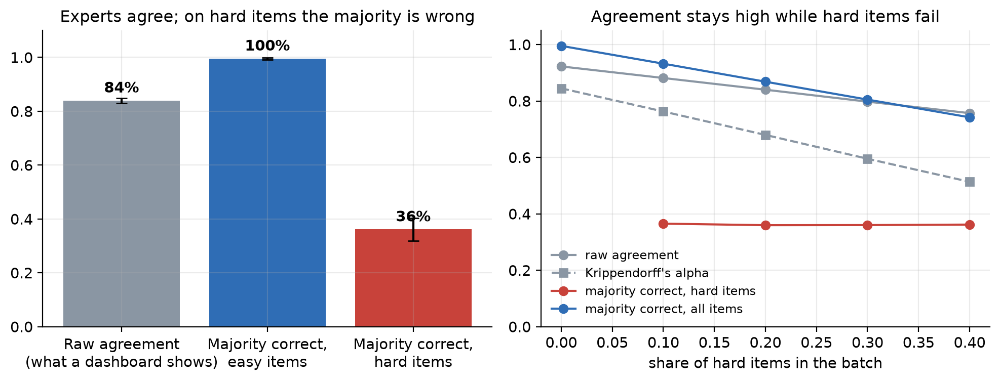
*Experts agree on 84% of ratings, but on hard items where a plausible wrong answer pulls the majority, it is right only 36% of the time.*

<p align="center">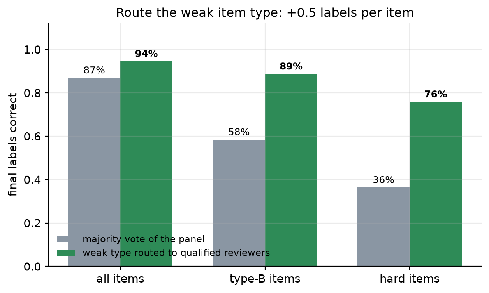</p>
<p align="center"><i>The fix: find the weak item type on gold items and route it to qualified reviewers. Hard items go from 36% to 76% correct, for half an extra label per item.</i></p>

The simulation also shows an agreement screen dropping a deep expert in every run; on the real DICES raters that did
not happen, so it holds only when a few experts are right where most raters are wrong. The sensitivity sweep
(`exp8`) maps where each finding holds: the screen stops removing deep experts once typical raters are right on
45% or more of hard items, while routing to qualified reviewers helps in every setting tested.

## As a system: a quality gate per batch

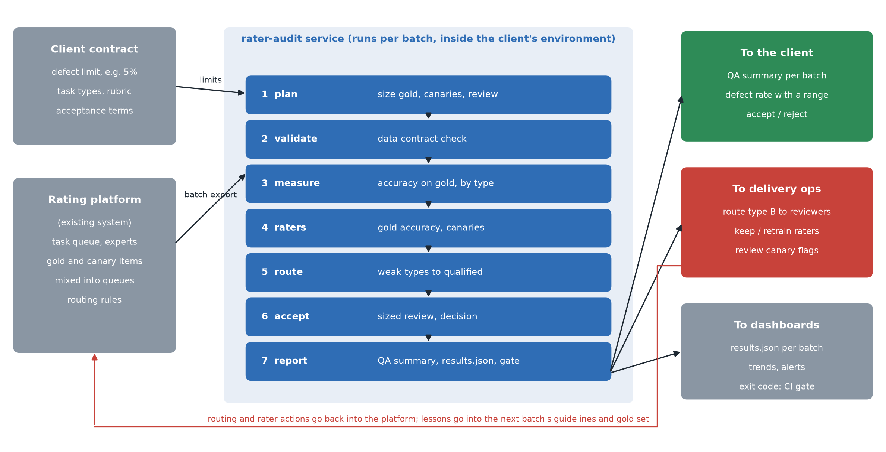

```bash
uv sync
uv run python -m rater_audit plan --raters 40 --items 20000       # size gold, canaries and the acceptance review
uv run python examples/make_example_batch.py                     # or export a real batch from the platform
uv run python -m rater_audit run examples/batch --config examples/rater_audit.toml
#   gate: FAIL  - acceptance review over the defect limit  - route item type B ...   (exit 0 PASS, 2 ACTION, 1 FAIL)
```

A batch is four CSV files with a fixed data contract (ratings, gold, canaries, acceptance review). Each run
validates the contract, writes `results.json` for dashboards and alerts and `qa_summary.md` for the client
([example](examples/qa_summary.md)), and returns an exit code so a delivery pipeline can block a failing batch.
Every threshold lives in the TOML config, not in the code. Build plan and integration points:
[docs/ARCHITECTURE.md](docs/ARCHITECTURE.md).

<details>
<summary>All figures and the pipeline, stage by stage</summary>

| # | Stage | Check in this repo |
|---|---|---|
| 1 | Scope and quality bar | acceptance plan sized from the contract limit and both risks (`plan`, exp 4) |
| 2 | Guidelines and gold set | gold items per rater and by item type (`plan`, exp 3, 9) |
| 3 | Rater qualification | reviewers chosen on gold accuracy (exp 3, 9) |
| 4 | Pilot batch and calibration | accuracy on gold per item type, with intervals (`run`) |
| 5 | Production monitoring | agreement vs accuracy (exp 1, 9), rater screens (exp 2, 7, 9), canary items (exp 5, 10) |
| 6 | Review and adjudication | routing the weak type to qualified reviewers (exp 3, 9) |
| 7 | Client acceptance | sized sampling plan, defect rate with an interval (exp 4, 9) |
| 8 | Delivery | QA summary and quality gate per batch (`run`) |
| 9 | Post-mortem | "for the next batch" section of the summary |
| — | Evaluations built on the ratings | ranking tiers, judge position bias, sprint size on 3,355 MT-Bench expert votes (exp 6, 7) |

| | |
|---|---|
| 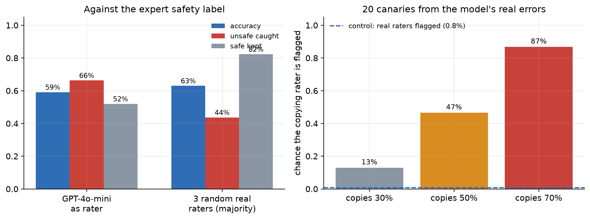 | 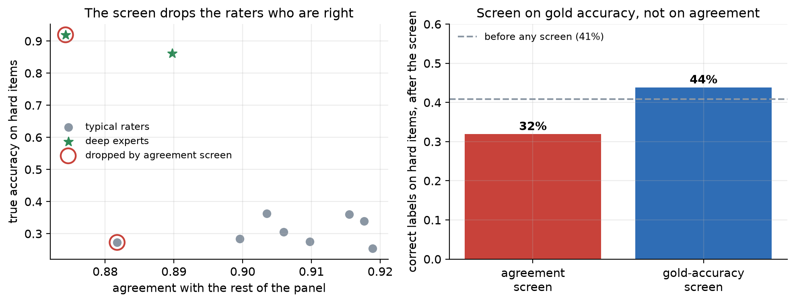 |
| *Real model outputs: GPT-4o-mini against the expert label, and canaries built from its real errors.* | *Simulation: an agreement screen drops the expert who is right when most raters share an error.* |
| 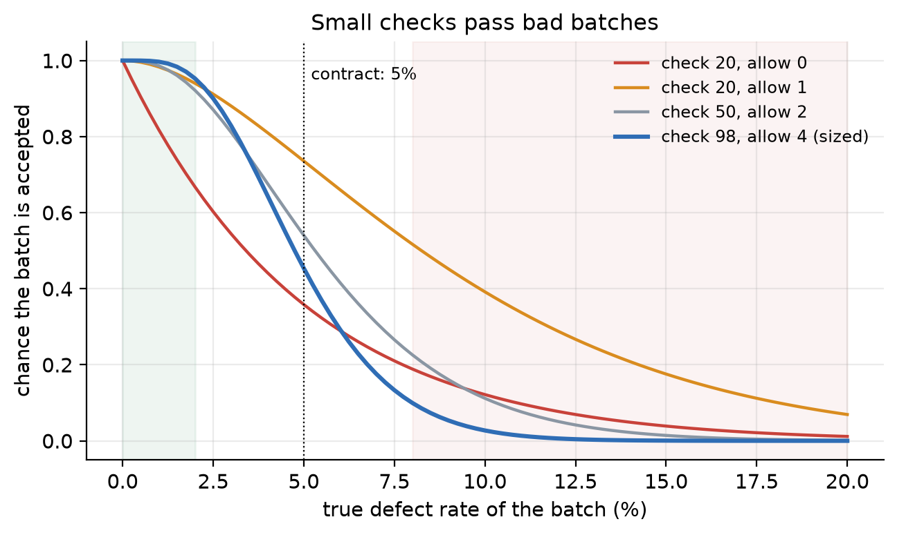 | 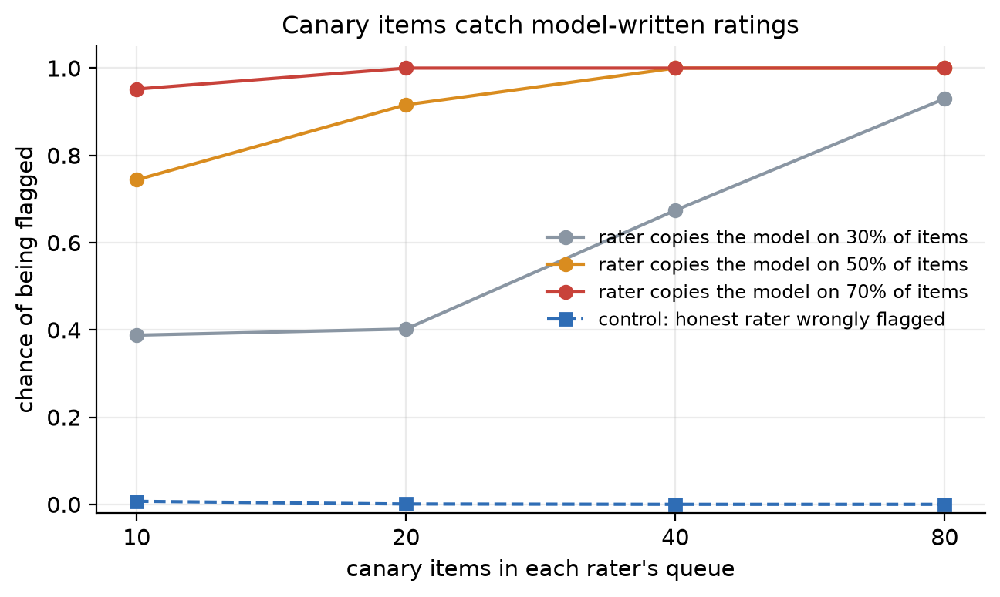 |
| *Chance that a batch passes, by its true defect rate: a 20-item check passes an 8% batch half the time; the sized plan (98 items, 4 defects) does not.* | *Simulation: canary items catch a rater who lets a model write the ratings; honest raters are almost never flagged.* |
| 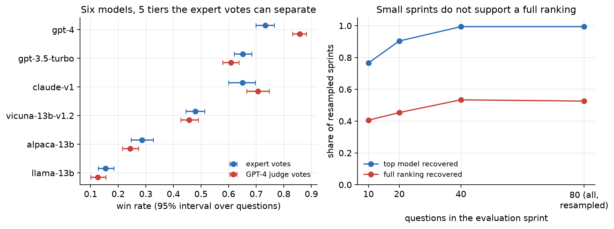 | 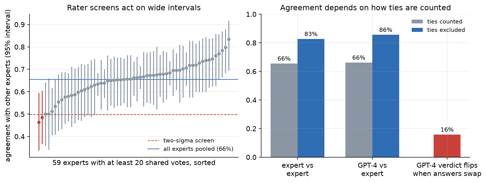 |
| *Real expert votes: six models fall into five tiers, and a GPT-4 judge separates two models the experts cannot. Even 40 questions recover the full ranking only about half the time.* | *Real expert votes: most of the spread between experts is sampling noise, and GPT-4 changes 16% of verdicts when the two answers swap places.* |
| 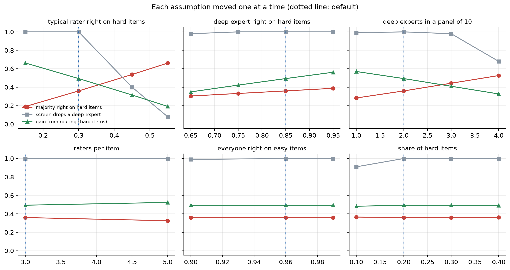 | |
| *Each simulation assumption moved one at a time: where the findings hold and where they stop.* | |
</details>

## Reproduce

```bash
uv sync && uv run pytest -q
for e in experiments/exp*.py; do uv run python "$e"; done     # results/*.json and figures/*.png
```

Model calls are cached in `data/llm_cache.jsonl`, so every number replays offline; a new model needs
`OPENROUTER_API_KEY` or `OPENAI_API_KEY`.

**Limits.** DICES is one safety task where disagreement partly reflects legitimate differences in perspective; the
expert label stands for the client's policy. Experiments 1 to 5 are simulations with assumed skill levels. MT-Bench
covers pairwise votes on six 2023 models.

Data: DICES (Aroyo et al., 2023, [arXiv:2306.11247](https://arxiv.org/abs/2306.11247)) and MT-Bench human judgments
(Zheng et al., 2023, [arXiv:2306.05685](https://arxiv.org/abs/2306.05685)), both CC-BY-4.0.
Code: MIT. Author: Vahit FERYAD &lt;vahit.feryat@gmail.com&gt;
